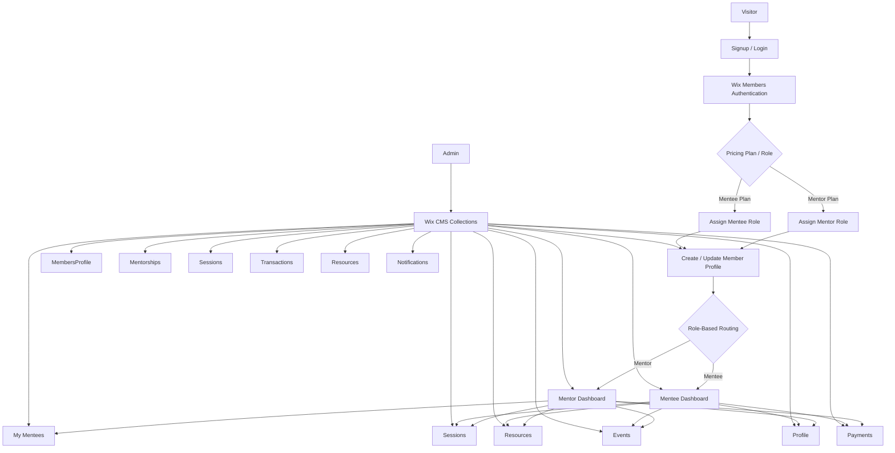
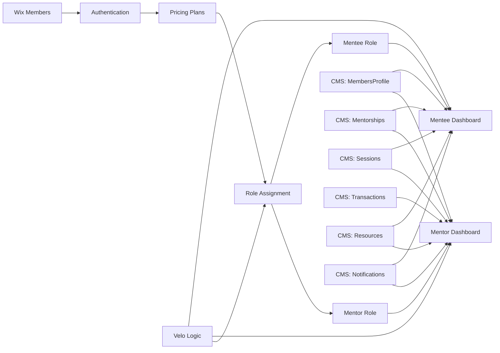

# PRD: Mentor/Mentee Member Platform in Wix

**Organization:** Mothers to Daughters Foundation (MTD)  
**Document type:** Product Requirements Document  
**Scope:** Wix-based member platform — Dashboard logic and RBAC (Role-Based Access Control)  
**Status:** Pre-migration reference — independent of mtd-site Next.js codebase

---

## 1. Product Overview

**Product name:** Mothers to Daughters Member Platform  
**Platform:** Wix + Wix Members + Wix Pricing Plans + Wix CMS + Velo  
**Purpose:** Provide a role-based community experience where mentors and mentees can sign up, subscribe, manage profiles, view different dashboards, access sessions/resources, and interact within the platform.

---

## 2. Goal

Create a members area that supports:

* mentor signup and subscription
* mentee signup and subscription
* different dashboard experiences by role
* mentor-to-mentee relationship tracking
* session visibility
* community/resource/event access
* profile management
* admin-manageable data structure
* future extensibility for messaging, notifications, and payments

---

## 3. Problem Statement

The default Wix Members Area is too generic for a role-based dashboard product. The platform needs:

* custom member onboarding
* separate mentor and mentee experiences
* controlled visibility of data
* relational records between mentors and mentees
* a dashboard matching the mock-up rather than default member pages

---

## 4. Success Criteria

The implementation is successful when:

* a user can sign up as mentor or mentee
* a user is automatically assigned the correct role after subscription/signup
* mentors and mentees see different dashboards
* mentors can view their assigned mentees
* mentees can view mentor-related information
* both can access profile/settings/resources/events
* admins can manage assignments and data without code changes
* dashboard widgets pull correct CMS-driven data

---

## 5. User Types

### Mentor

Needs to:

* subscribe as a mentor
* manage profile
* see dashboard stats
* view assigned mentees
* view sessions
* access resources/events/community
* track hours/impact

### Mentee

Needs to:

* subscribe as a mentee
* manage profile
* see dashboard
* view mentor relationship
* view sessions/resources/events/community
* track progress

### Admin

Needs to:

* manage members
* assign mentor/mentee relationships
* review subscriptions
* update CMS data
* moderate content/resources/events

---

## 6. Scope

### In Scope

* Wix member authentication
* mentor/mentee role assignment
* custom dashboards
* CMS collections
* mentor/mentee relationship model
* subscriptions via Pricing Plans
* role-based navigation
* profile pages
* resources/events pages
* basic notifications placeholder
* session tracking

### Out of Scope for Phase 1

* advanced chat
* matching algorithm automation
* live video sessions
* wallet ledger automation
* mobile app
* highly granular permissions beyond role-based logic

---

## 7. Functional Requirements

### Authentication

* Users can sign up and log in through Wix Members.
* Users select mentor or mentee path during onboarding or through separate pricing plans.
* System creates a profile record after signup.

### Role Management

* Each member has one primary role:
  * mentor
  * mentee
  * admin
* Role controls:
  * landing page after login
  * visible navigation
  * dashboard widgets
  * CMS query filters

### Subscription

* Mentor and mentee each have their own pricing plan.
* On successful purchase, member gets correct role and onboarding state.

### Dashboard

#### Mentor dashboard includes:

* welcome section
* active mentee count
* sessions this year
* hours volunteered
* next session
* mentorship tracker
* recent messages placeholder
* notifications placeholder
* wallet/payments placeholder if needed

#### Mentee dashboard includes:

* welcome section
* mentor card
* next session
* progress tracker
* recent messages placeholder
* resources/events shortcut
* notifications placeholder

### Profile

* Members can update profile information.
* Profile displays differently depending on role.

### Mentor/Mentee Relationship

* A mentor can have multiple mentees.
* A mentee belongs to one mentor in Phase 1.
* Relationship status can be active, pending, completed.

### Sessions

* Sessions are stored in CMS.
* Members only see sessions relevant to them.

### Resources / Events / Community

* Shared pages accessible to both roles.
* Content may later be filtered by role.

---

## 8. Non-Functional Requirements

* Must run fully in Wix
* Must be admin-manageable through CMS
* Must support responsive layouts
* Must keep role-based data separated in front-end queries and permissions
* Must be structured for future extension into messaging/payments

---

## 9. Information Architecture

### Main Pages

#### Public

* Home
* About
* Programs
* Blog
* Mentors Mixer
* Become a Partner
* Donate
* Login / Sign Up
* Pricing / Membership Plans

#### Private Member Pages

* Dashboard
* My Sessions
* Community Chat
* Resources
* Events
* Achievements
* My Impact
* Payments
* Profile
* Settings
* Help & Support

#### Mentor-Only

* My Mentees

#### Admin-Only

* Assignment Management
* CMS management views

---

## 10. Recommended Wix Architecture

### Architectural Decision

Use:

* **Wix Members** for authentication
* **Wix Pricing Plans** for paid access
* **Wix CMS Collections** for app data
* **Velo** for role routing, custom queries, and page behavior
* **Custom pages**, not default Members Area, for dashboard experience

---

## 11. High-Level Architecture Diagram




---

## 12. CMS Data Model

### 12.1 MembersProfile

Stores app-specific member details beyond Wix auth.

Fields:

* `memberId` (text, unique)
* `email` (text)
* `fullName` (text)
* `role` (text: mentor, mentee, admin)
* `photo` (image)
* `bio` (rich text/text)
* `location` (text)
* `industry` (text)
* `onboardingComplete` (boolean)
* `walletBalance` (number, optional)
* `hoursVolunteered` (number, optional)
* `isActive` (boolean)

---

### 12.2 Mentorships

Maps mentors to mentees.

Fields:

* `mentorMemberId` (text)
* `menteeMemberId` (text)
* `status` (text: pending, active, completed)
* `startDate` (date)
* `progressPercent` (number)
* `notes` (text)
* `programName` (text)

---

### 12.3 Sessions

Stores mentoring sessions.

Fields:

* `mentorMemberId` (text)
* `menteeMemberId` (text)
* `sessionDate` (datetime)
* `durationMinutes` (number)
* `status` (text: scheduled, completed, canceled)
* `title` (text)
* `notes` (text)

---

### 12.4 Transactions

Optional for wallet/payment display.

Fields:

* `memberId` (text)
* `transactionDate` (datetime)
* `amount` (number)
* `type` (text: topup, workshop, resource, refund)
* `balanceAfter` (number)
* `label` (text)

---

### 12.5 Resources

Fields:

* `title`
* `description`
* `resourceType`
* `audienceRole` (mentor, mentee, all)
* `link/file`
* `published`

---

### 12.6 Notifications

Fields:

* `memberId`
* `title`
* `body`
* `type`
* `isRead`
* `createdAt`

---

## 13. Page Structure

### Private Pages

#### `/dashboard`

This should be a routing/redirect page only, not a true dashboard.

Logic:

* if mentor → `/mentor-dashboard`
* if mentee → `/mentee-dashboard`

#### `/mentor-dashboard`

Custom dashboard matching mock-up:

* KPI cards
* upcoming session
* mentorship tracker
* notifications
* wallet/payment summary
* recent messages placeholder

#### `/mentee-dashboard`

Custom dashboard for mentees:

* assigned mentor
* upcoming session
* progress
* resources/events
* notifications

#### `/my-mentees`

Mentor-only list/detail page of assigned mentees.

#### `/my-sessions`

Shared page filtered by current user role and ID.

#### `/profile`

Shared page with role-specific sections.

#### `/settings`

Shared.

#### `/resources`, `/events`, `/community-chat`, `/payments`

Shared pages with role-based visibility/content as needed.

---

## 14. Role-Based UX Rules

### Mentor Sees

* Dashboard
* My Mentees
* My Sessions
* Community Chat
* Resources
* Events
* Achievements
* My Impact
* Payments
* Profile
* Settings
* Help

### Mentee Sees

* Dashboard
* My Sessions
* Community Chat
* Resources
* Events
* Achievements
* Payments
* Profile
* Settings
* Help

Mentees should not see:

* My Mentees
* mentor-only metrics

---

## 15. Permissions Strategy

### Important note

Wix collection permissions alone are not enough for a full app-like experience. Use both:

* collection permissions
* front-end filtering
* backend validation where needed

### Recommended permission posture

* `MembersProfile`: site member author or admin-managed
* `Mentorships`: admin create/update, members read only if filtered to relevant records
* `Sessions`: admin/authorized system create, filtered read
* `Transactions`: admin/system managed
* `Resources`: read for members
* `Notifications`: per-member filtered

---

## 16. Technical Implementation Plan

### Phase 1: Foundation

#### Step 1: Set up Wix apps

Install/configure:

* Wix Members
* Wix Pricing Plans
* CMS
* Velo

#### Step 2: Define roles

Create:

* Mentor
* Mentee
* Admin

#### Step 3: Create pricing plans

Create plans:

* Mentor Membership
* Mentee Membership

#### Step 4: Build CMS collections

Create all core collections:

* MembersProfile
* Mentorships
* Sessions
* Transactions
* Resources
* Notifications

#### Step 5: Build signup flow

Decide one of two patterns:

* separate mentor and mentee signup buttons
* one signup page with role selection then route to plan purchase

Recommended:

* separate CTA buttons for mentor and mentee for simplicity

---

### Phase 2: Onboarding and Role Assignment

#### Step 6: Assign roles on plan purchase

Use Velo backend event to:

* detect purchased plan
* assign mentor or mentee role
* create/update profile row in `MembersProfile`

#### Step 7: Create profile initialization

When user first subscribes:

* create `MembersProfile` record
* store `memberId`
* set `role`
* mark onboarding incomplete

#### Step 8: Create onboarding/profile completion page

Prompt user to complete:

* name
* bio
* profile image
* location
* industry/goals

---

### Phase 3: Dashboard Routing

#### Step 9: Create `/dashboard` redirect logic

On page load:

* check logged-in member
* query `MembersProfile`
* redirect by role

Pseudo-logic:

```javascript
if not logged in -> login page
if role = mentor -> mentor dashboard
if role = mentee -> mentee dashboard
```

#### Step 10: Create global sidebar/header component

Build a reusable site component for member navigation.
Show/hide links by role.

---

### Phase 4: Mentor Dashboard

#### Step 11: Build mentor dashboard widgets

Widgets should query:

* active mentees count from `Mentorships`
* sessions this year from `Sessions`
* hours volunteered from `MembersProfile` or derived sessions
* next session from `Sessions`
* transaction summary from `Transactions`
* notifications from `Notifications`

#### Step 12: Build mentorship tracker

Query all active `Mentorships` for current mentor and render repeater/cards.

#### Step 13: Build recent messages placeholder

For Phase 1, use placeholder UI or a simple collection-backed recent communication list.

---

### Phase 5: Mentee Dashboard

#### Step 14: Build mentee dashboard widgets

Widgets should query:

* assigned mentor from `Mentorships`
* next upcoming session from `Sessions`
* progress from `Mentorships`
* notifications from `Notifications`
* resources/events shortcuts

---

### Phase 6: Core Feature Pages

#### Step 15: Build My Mentees page

Mentor-only page.
Show all active mentees linked to mentor.

#### Step 16: Build My Sessions page

Shared page with filtering:

* mentors see sessions where `mentorMemberId = currentUser`
* mentees see sessions where `menteeMemberId = currentUser`

#### Step 17: Build Profile page

Pull from `MembersProfile`.
Allow current member to edit their record.

#### Step 18: Build Resources and Events pages

Use CMS-driven repeaters/datasets.

---

### Phase 7: Admin Operations

#### Step 19: Build mentorship assignment workflow

Admin manually creates mentorship records in CMS or through a simple hidden admin page.

#### Step 20: Build QA/admin test accounts

Create:

* one mentor test account
* one mentee test account
* seeded mentorship and session data

---

## 17. Suggested Backend Logic Areas in Velo

You will likely need code in these areas:

### Backend events

* pricing plan purchase event
* member profile creation/update
* optional session/notification automation

### Frontend page code

* role checks
* page redirects
* dashboard queries
* sidebar visibility
* conditional rendering

### Shared utilities

* get current member profile
* get current role
* fetch mentor/mentee relationships
* fetch dashboard KPIs

---

## 18. Recommended Development Sequence

Here is the cleanest order to build this in Wix:

1. Install apps and enable Velo
2. Create roles
3. Create pricing plans
4. Create CMS collections
5. Build signup/subscription flow
6. Build role assignment logic
7. Build profile creation logic
8. Create dashboard redirect page
9. Build mentor dashboard
10. Build mentee dashboard
11. Build sidebar/navigation component
12. Build My Mentees page
13. Build My Sessions page
14. Build Profile/Settings pages
15. Build Resources/Events pages
16. Seed test data
17. QA permissions and role visibility
18. Polish UI to match Figma mock-up

---

## 19. Risks / Constraints in Wix

### Risk 1: Default Members Area conflict

If you keep too much of Wix's default members pages enabled, it can confuse routing and UX.

**Recommendation:** minimize use of default member pages and rely on custom private pages.

### Risk 2: Complex relational logic

Wix CMS is not as flexible as a full relational backend.

**Recommendation:** keep relationships simple:

* one mentee to one mentor in Phase 1
* use IDs, not overly complex references everywhere

### Risk 3: Role-based visibility can get messy

Too much conditional rendering on one page becomes hard to maintain.

**Recommendation:** use separate mentor and mentee dashboards.

### Risk 4: Messaging/chat complexity

Real-time chat in Wix can become a project of its own.

**Recommendation:** treat chat as Phase 2 unless it is essential.

---

## 20. Build Recommendation

### Best architecture for your case in Wix

Use this pattern:

* **One login system**
* **Two pricing plans**
* **Two member roles**
* **Two custom dashboards**
* **Shared navigation shell**
* **CMS as app database**
* **Velo for routing and queries**
* **Admin-managed mentorship assignment**

That is the most stable and maintainable version of this platform in Wix.

---

## 21. MVP Release Definition

For MVP, launch with:

* mentor signup/subscription
* mentee signup/subscription
* role assignment
* mentor dashboard
* mentee dashboard
* profile management
* mentor/mentee relationship records
* session records
* resources/events access
* role-based navigation

Hold these for later:

* full chat
* wallet automation
* advanced notification system
* automatic matching

---

## 22. Final Architecture Summary




---

## 23. Implementation Hand-off Checklist

Before development starts, confirm:

* [ ] mentor and mentee plan names
* [ ] mentor and mentee onboarding fields
* [ ] whether mentees can have more than one mentor
* [ ] whether mentors can self-manage session scheduling
* [ ] whether chat is MVP or post-MVP
* [ ] whether wallet/payments is real or display-only in Phase 1
* [ ] whether admin assignment is manual or semi-automated

---

*Last updated: 2026-03-07*  
*Document owner: MTD Engineering / Content Team*
